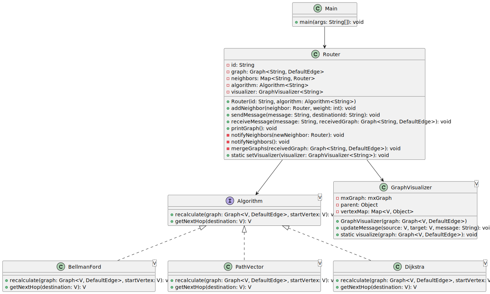

# Prova de Conceito: Sistema de Roteamento de Redes

Este projeto é uma Prova de Conceito (PoC) que implementa um sistema de roteamento de redes utilizando algoritmos de roteamento e visualização gráfica. O objetivo é simular o comportamento de roteadores em uma rede, incluindo o cálculo de caminhos, envio de mensagens e visualização das conexões e mensagens trocadas entre os roteadores.

## Estrutura do Projeto

O projeto está organizado nas seguintes pastas e arquivos principais:

- `src/main/java/ifsc/edu/br/algorithm/`: Contém os algoritmos de roteamento.
  - `Algorithm.java`: Interface para os algoritmos de roteamento.
  - `BellmanFord.java`: Implementação do algoritmo de Bellman-Ford.
  - `PathVector.java`: Implementação do algoritmo de vetor de caminhos.
  - `Dijkstra.java`: Implementação do algoritmo de Dijkstra.
  - [ALGORITIMOS.md](src/main/java/ifsc/edu/br/algorithm/ALGORITIMOS.md): Documentação dos algoritmos de roteamento.

- `src/main/java/ifsc/edu/br/router/`: Contém a classe principal do roteador.
  - `Router.java`: Classe que representa um roteador na rede.
  - [ROTEADOR.md](src/main/java/ifsc/edu/br/router/ROTEADOR.md): Documentação da classe Router.

- `src/main/java/ifsc/edu/br/utils/`: Contém utilitários para visualização.
  - `GraphDrawer.java`: Classe para visualização gráfica da rede de roteadores.

## Diagrama de Classes

